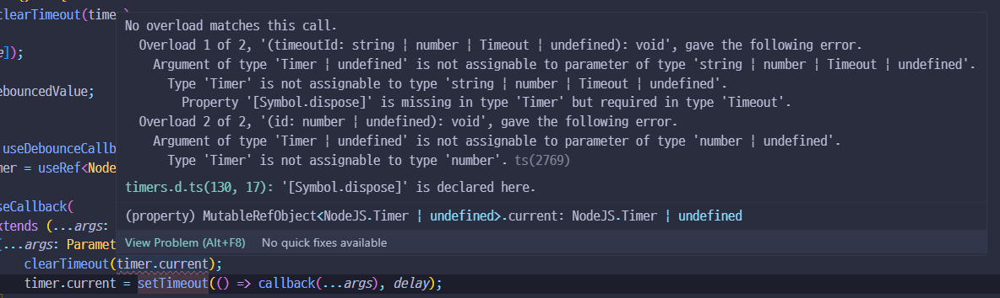

# 타입이 정의 되어있는 외부 라이브러리 type 사용

atom 레벨의 자바스크립트 컴포넌트를  타입스크립트로 조금씩 변환하고 있다.

split된 페이지를 구현할 때 `react-split`라이브러리를 사용하고 있는데, 이 라이브러리의  css 커스텀을 위해 `<Splitter/>` 라는 컴포넌트를 만들어 한 겹 싸서 사용 중이다.

컴포넌트에 `children`과 라이브러리에서 정의한 옵션 값들만 그대로 props로 내리는  간단한 컴포넌트

```javascript
import "./Splitter.css";
import Split from "react-split";

function Splitter({ children, ...props }) {
  const directionStyle = props.direction || "horizontal"; // 기본값 'horizontal'

  return (
    <Split {...props} className={`Splitter ${directionStyle}`}>
      {children}
    </Split>
  );
}

export default Splitter;
```

````jsx
<Splitter
    sizes={[18, 82]} // %
    minSize={[176, 364]} // px
    expandToMin={true}
    direction='vertical'
    gutterSize={4}
>
    <div>
       ...
    </div>
</Splitter>
```
````


`react-split` 라이브러리는 타입스크립트를 지원하기 때문에 타입 정의를 따라가 보면 사용하는 옵션 값들이 친절하게 타입 정의 되어있다.

<figure><figcaption></figcaption></figure>

`...props` 으로 내린 값들은 어떻게 정의하지 고민했는데 어렵게 직접  정의할 필요없이 정의되어 있는 타입을 `import` 하여 `extends` 해 타입을 정의하면 된다.

```typescript
import './Splitter.css';
import Split, { SplitProps } from 'react-split';

interface SplitterProps extends SplitProps {
    children: React.ReactNode;
}

function Splitter({ children, ...props }: SplitterProps) {
    const directionStyle = props.direction || 'horizontal'; // 기본값 'horizontal'

    return (
        <Split {...props} className={`Splitter ${directionStyle}`}>
            {children}
        </Split>
    );
}

export default Splitter;
```


