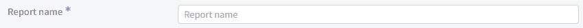

# 리액트:: 일반 텍스트와 태그를 같이 입력하는 input 만들기 (feat. inline 코드)

input 태그의 앞이나 뒤에 아이콘, 태그 등의 다른 컴포넌트를 넣는 것이라면 fake input을 만들어서 할 수 있다. 입력 시 태그로 하나 하나씩 변환되는 태그 input도 같은 맥락으로 input 앞에 태그 컴포넌트를 끼워넣으면 손 쉽게 만들 수 있다.

하지만 일반 텍스트와 태그를 섞어 입력토록 하는 것은 이 방법으로는 불가능하다.&#x20;

단순한 input 태그에는 절대 일반 텍스트 외에는 다른 컴포넌트를 끼워넣을 수 없기 때문이다. 하지만 노션이나 다른 텍스트 에디터에서 백틱(\`\`) 입력시 inline 코드를 지원하는 것처럼 다른 방법으로 이러한 input을 만들 수 있다.

<figure><figcaption></figcaption></figure>


### 요구사항

내가 마주한 요구사항은 다음과 같다.

1. 사전에 지정된 예약어가 존재하며, 해당 예약어를 대괄호 \[]로 감싸 입력한 후 space를 누르면 Tag로 변경된다.
2. 일반 텍스트와 예약어는 섞어 입력할 수 있다.


### 컨셉

1. \<div>에 contentEditable 옵션을 줘서 \<div>를 input 처럼 만들기
2. onKeyDown을 통해 space 키를 눌렀을 경우 \
   1\) `innerHTML`에서 `[예약어]` 가 있는지 찾는다.\
   2\) 존재하는 경우 `replace` 함수를 이용하여 `[예약어]` 를 Tag 컴포넌트로 변경한 `newInnerHTML`을 만든다. \
   3\) `innerHTML`에 새로 만든 `newInnerHTML`을 할당한다.


### 1.  입력 가능한 \<div> 만들기

\<div> 태그에 contentEditable 옵션을 주면 input 처럼 만들 수 있다. 다만 \<div>는 `onChange` 가 없기 때문에 `onInput`을 이용하여 변경된 value를 감지해야한다.

```tsx
const ref = useRef<HTMLDivElement>(null);

return (
    <div
        ref={ref}
        id='ReportNameTextField'
        className={s.ReportNameTextField}
        tabIndex={0}
        contentEditable
        data-placeholder={'Report Name'}
        onInput={onInputHandler}
        onKeyDown={onKeyHandler}
    ></div>
);
```

* innerHTML을 조작하기 위한 `ref` 부여
* tab 포커스가 가능하게 하기 위해 `tabIndex={0}` 지정
* `contentEditable`로 입력 가능하게 변경
* placeholder를 주기 위해 `data-placeholder` 부여
* 변경된  value를 제어하기 위한 `onInput`
* 키보드 이벤트를 제어하기 위한 `onKeyDown`

input 처럼 value prop이 없기 때문에 비제어적으로 동작한다. 나는 `onInput`으로 변경된 value를 감지하고 value가 변경될 때마다 상위 컴포넌트로 value를 전달하기 위해 value state를 따로만들어 사용했다.


### 2. Space를 누를 때 태그로 변경하기

요구사항을 보면 `[예약어]` 형식으로 예약어를 대괄호로 감싸 입력한 후 space를 누르면 태그로 변환된다고 하였다. `e.key`가 space일 때 이 동작을 수행하도록 한다.

```typescript
const getJSXTag = (tag: string, id: Number) => {
    return `<span class=${s.tag} id=${`report-tag-${id}`}>${tag}</span>`;
};


const onKeyHandler = (e: KeyboardEvent<HTMLDivElement>) => {
    let { innerHTML, childElementCount: tagCount } = e.currentTarget;

    // 예약어 감지
    if (e.key === ' ') {
        for (let tag of reportReservedWords) {
            const target = `[${tag}]`;

            if (innerHTML.includes(target)) {
                let newInnerHTML = innerHTML.replace(
                    target,
                    getJSXTag(tag, tagCount)
                );

                if (ref.current !== null) {
                    ref.current.innerHTML = newInnerHTML;
                    ref.current.innerHTML += '&nbsp';
                }
                focusContentEditableTextToEnd(e.currentTarget);
            }
        }
    }
};
```

참고로 예약어 목록은 `[ 'DATE', 'YEAR', 'MONTH', 'WEEK' ]`  4개다.

1. reportReservedWords 배열을 하나씩 돌면서 `innerHTML`에 예약어가 입력 되어 있는지 확인한다.
2. 만약 포함 되어 있다면 `innerHTML.replace()`를 이용하여 예약어를 `<span>` 태그로 만든 태그로 바꾼다.
3. ref.current.innerHTML을 새로 만든 newInnerHTML로 할당한다.
4. 마지막 끝에 빈 공백을 추가로 삽입한다.
5. 입력 커서를 맨 뒤로 옮긴다.


빈 공백을 추가로 삽입하지 않으면 교체된 태그에 입력이 되어 원치 않게 태그에 입력이 가게 된다.

또한 \<div>를 contentEditable로 만든 것은 포커스가 항상 맨 앞으로 가게 되어서 모든 동작 수행 후에는 포커스를 맨 뒤로 보내게 하였다.


### 3. 태그 삭제하기


\+) 추가

innerHTML, innerContent 등 차이점 설명


