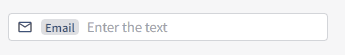

# 리액트) 아이콘, 태그를 넣을 수 있는 input 만들기

`<input/>` 태그를 커스텀하여 사용할 때, input 필드 안에  아이콘을 넣고 싶다면 아이콘을 `display: absolute` 등을 지정하여 위치를 조정하는 식을 많이 하곤 한다.

하지만 아이콘을 앞 뒤로 넣고 싶다면? 아이콘 앞에 태그 같은 것도 넣고 싶다면? \
이런 경우 모든 케이스들을 고려하여 아이콘 위치를 잡고 input에 padding을 주기란 어려울 것이다.

이 때 `<div>`로 `<input>`과 아이콘을 감싸고 `<div>`가 input focus인 것처럼 작동하는 input을 만들어보자.


### 컨셉

컨셉은 간단하다.

1. `<div>` 안에  `<input/>`, 아이콘, `<span>`등을 넣고 flex로 내부 정렬을 한다.
2. `<div>` 에  `:focus-within` CSS를 부여하여 `<input/>` 태그를 클릭했을 때 `<div>`에 focus가 가는 것 같은 효과를 준다.


### 커스텀 컴포넌트 만들기

나는 input 하단에 helpMessage나 errorMessage도 넣어야 해서 `<div>`를 두 번 감쌌다.\
필요한 아이콘이나 태그는 props로 받아 원하는 위치에 세팅한다.

```html
<div className={s.TextField}>
    <div className={s.inputContainer}>  // 실제 input 처럼 보이게 되는 부분
        <div>{icon}</div>
        <div>{tag}</div>
        <input/>
    </div>
    {helpMessage}  // input 바깥 쪽에 표시될 메시지들
    {errorMessage}
</div>
```

```tsx
const TextField = forwardRef(
    (
        {
            icon,
            tag,
            value = '',
            disabled,
            placeholder,
            helpMessage = '',
            errorMessage = '',
            onChangeHandler = undefined,
        }: TextFieldProps,
        ref?: React.ForwardedRef<HTMLInputElement> | undefined
    ) => {
        return (
            <div className={s.TextField}>
                <div className={s.inputContainer}>
                    {icon && <div className={s.icon}>{icon}</div>}
                    {tag && <Tag key={tag} title={tag} />}
                    <input
                        ref={ref}
                        className={s.input}
                        disabled={disabled}
                        value={value}
                        placeholder={placeholder}
                        onChange={onChangeHandler}
                    />
                </div>
                {helpMessage}
                {errorMessage && (
                    <p className={s.error_message}>{errorMessage}</p>
                )}
            </div>
        );
    }
);
```


### CSS 적용

코드는 SCSS 입니다.

1. `.inputContainer`에 `flex`를 이용해 내부 아이콘, 태그, `<input/>` 를 정렬한다.
2. `border`를 줘서 일반 `<input/>` 태그처럼 보이게 한다.
3. `:focus-within` 속성을 부여하여 실제 `<input/>` 태그에 focus가 갈 때, 감싸고 있는 컨테이너의 border의 색을 변경하여 포커스된 것처럼 만든다.

```scss
.TextField {
    display: flex;
    flex-direction: column;
    width: 320px;
    gap: 4px;

    .inputContainer {
        display: flex;
        align-items: center;
        gap: 8px;
        height: 28px;
        padding: 4px 8px;
        border-radius: 4px;
        border: 1px solid colors.$NETURAL_LIGHT_200;
        background-color: colors.$NETURAL_LIGHT_0;

        .icon {
            display: flex;
            color: colors.$NETURAL_LIGHT_700;
            > :first-child {
                width: 16px;
                height: 16px;
            }
        }

        .input {
            width: 100%;
            color: colors.$NETURAL_LIGHT_800;
            @include typography.TYPO_BODY_01_NORMAL;

            &::placeholder {
                color: colors.$NETURAL_LIGHT_400;
            }
            &:disabled {
                background-color: colors.$NETURAL_LIGHT_0;
                color: colors.$NETURAL_LIGHT_300;
            }
        }

        &:focus-within {
            border: 2px solid colors.$PURPLE_500;
            padding: 4px 7px;
            outline: none;
        }
    }
}
```


### 실제 사용되는 코드

```jsx
<TextField2
    value={value}
    tag={'Email'}
    icon={<MailOutlineIcon />}
    placeholder='Enter the text'
    onChangeHandler={(e) => setValue(e.target.value)}
/>
```


원한다면 아이콘도, 태그도 넣을 수 있는 커스텀  input 컴포넌트 완성!

<figure><figcaption></figcaption></figure>


