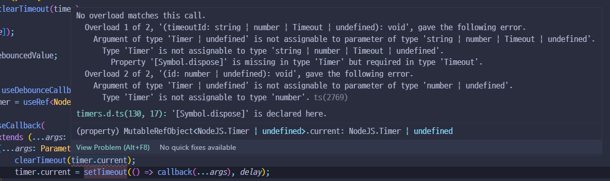

# useDebounce 적용 시 setTimeout 함수 타입


함수에 debounce를 걸어야 돼서 커스텀 훅으로 만들어 사용하는데 에러가 난다.

```typescript
export const useDebounceCallback = () => {
    const timer = useRef<NodeJS.Timer>();

    return useCallback(
        <T extends (...args: any[]) => void>(callback: T, delay: number) =>
            (...args: Parameters<T>) => {
                clearTimeout(timer.current); // <- 에러
                timer.current = setTimeout(() => callback(...args), delay);
            },
        []
    );
};
```


## 에러. Overload 1 of 2, '(timeoutId: string | number | Timeout | undefined): void', gave the following error. Argument of type 'Timer | undefined'&#x20;

`clearTimeout` 함수는 인자로 `timeoutId`를 받는데 이는 타입이 `(timeoutId: string | number | Timeout | undefined)` 이렇게 된다.&#x20;

근데 지금 넘기고 있는 건 `NodeJS.Timer` 타입으로 매개변수로 (`Timer | undefined)`를 넘기려고 하니 안된다고 에러가 나는 것이다.&#x20;


No overload matches this call. \
Overload 1 of 2, '(timeoutId: string | number | Timeout | undefined): void', gave the following error. Argument of type 'Timer | undefined' is not assignable to parameter of type 'string | number | Timeout | undefined'. Type 'Timer' is not assignable to type 'string | number | Timeout | undefined'. Property '\[Symbol.dispose]' is missing in type 'Timer' but required in type 'Timeout'. \
\
Overload 2 of 2, '(id: number | undefined): void', gave the following error. Argument of type 'Timer | undefined' is not assignable to parameter of type 'number | undefined'. Type 'Timer' is not assignable to type 'number'.ts(2769)


<figure><figcaption></figcaption></figure>


## 해결. NodeJS.Timeout 타입

`setTimeout` 함수의 반환 타입을 다시 잘 보니 `NodeJS.Timer`가 아니라 `NodeJS.Timeout`

<figure><figcaption></figcaption></figure>

timer로 지정한 `useRef`의 타입을 `NodeJS.Timeout`으로 잘 지정해준다.

```typescript
const timer = useRef<NodeJS.Timeout>();
```


은근히 타입을 잘못봐서 에러 나는 경우도 많은 듯 하다,,


#### 참고&#x20;

debounce를 만드는 데 참고한 포스팅들

* [https://velog.io/@2ast/React-useDebounce%EC%99%80-useThrottle-%EB%A7%8C%EB%93%A4%EA%B8%B0](https://velog.io/@2ast/React-useDebounce%EC%99%80-useThrottle-%EB%A7%8C%EB%93%A4%EA%B8%B0)
* [https://velog.io/@kokoball0/React-Throttle-Debounce-feat.-React-Hook](https://velog.io/@kokoball0/React-Throttle-Debounce-feat.-React-Hook)
* [https://velog.io/@jsi06138/React%EC%97%90%EC%84%9C-debounce-%EC%82%AC%EC%9A%A9-%E3%83%BB-%EA%B5%AC%ED%98%84%ED%95%98%EA%B8%B0](https://velog.io/@jsi06138/React%EC%97%90%EC%84%9C-debounce-%EC%82%AC%EC%9A%A9-%E3%83%BB-%EA%B5%AC%ED%98%84%ED%95%98%EA%B8%B0)
* [https://lasbe.tistory.com/153#%F0%9F%93%8C\_React%EC%97%90%EC%84%9C\_Debounce\_%EA%B5%AC%ED%98%84%ED%95%98%EA%B8%B0](https://lasbe.tistory.com/153#%F0%9F%93%8C\_React%EC%97%90%EC%84%9C\_Debounce\_%EA%B5%AC%ED%98%84%ED%95%98%EA%B8%B0)

